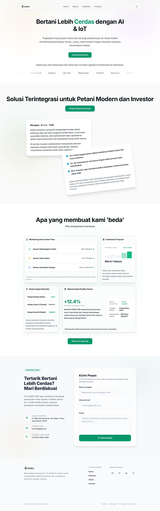

# AIGRA EON — Platform Smart Farming Indonesia

> Platform agritech berbasis AI & IoT untuk meningkatkan efisiensi pertanian dan mendukung ketahanan pangan nasional.

🚀 **Live Demo:** [https://test-aigra.vercel.app/](https://test-aigra.vercel.app/)



---

## 🌱 Tentang Proyek

**AIGRA EON** adalah landing page platform smart farming yang menghubungkan petani dengan teknologi IoT dan kecerdasan buatan. Platform ini menyediakan:

- Monitoring sensor real-time (kelembapan tanah, suhu, intensitas cahaya)
- Sistem irigasi otomatis berbasis data sensor
- Analitik & rekomendasi prediksi panen berbasis AI
- Dashboard terpusat untuk manajemen lahan lintas wilayah
- Skema kemitraan antara petani dan investor agritech

---

## 🛠️ Tech Stack

| Teknologi | Versi | Kegunaan |
|---|---|---|
| [React](https://react.dev/) | ^19.2.7 | UI Framework |
| [Vite](https://vite.dev/) | ^8.1.1 | Build Tool & Dev Server |
| [Tailwind CSS](https://tailwindcss.com/) | ^3.4.19 | Utility-first Styling |
| [Framer Motion](https://www.framer.com/motion/) | ^12.42.2 | Animasi & Transisi |
| [Lucide React](https://lucide.dev/) | ^0.469.0 | Icon Library |
| [PostCSS](https://postcss.org/) | ^8.5.19 | CSS Processing |

---

## 📁 Struktur Proyek

```
src/
├── components/
│   ├── Button.jsx       # Komponen tombol reusable
│   ├── Input.jsx        # Komponen input form dengan validasi
│   └── Navbar.jsx       # Navigasi utama dengan dark mode toggle
├── sections/
│   ├── Hero.jsx         # Halaman utama / hero section
│   ├── About.jsx        # Tentang AIGRA EON
│   ├── Features.jsx     # Fitur-fitur platform
│   ├── Contact.jsx      # Form kontak & informasi
│   └── Footer.jsx       # Footer halaman
├── App.jsx              # Root component & routing sections
├── index.css            # Global styles & custom animations
└── main.jsx             # Entry point aplikasi
```

---

## 🚀 Cara Menjalankan

### Prasyarat

Pastikan sudah terinstall:
- [Node.js](https://nodejs.org/) (v18 atau lebih baru)
- [npm](https://www.npmjs.com/) atau [yarn](https://yarnpkg.com/)

### Instalasi

```bash
# Clone repository
git clone https://github.com/faizfznn/test-aigra.git
cd test-aigra

# Install dependencies
npm install
```

### Development

```bash
npm run dev
```

Buka browser dan akses `http://localhost:5173`

### Build Production

```bash
npm run build
```

### Preview Build

```bash
npm run preview
```

---

## ✨ Fitur Desain

- **Dark Mode** — Toggle dark/light mode di navbar
- **Responsive** — Tampilan optimal di mobile, tablet, dan desktop
- **Animasi** — Marquee logo mitra, slide-down mobile menu, fade-in validasi form
- **Glassmorphism** — Card dengan efek kaca pada section kontak
- **Smooth Scroll** — Navigasi antar section yang mulus

---

## 📄 Lisensi

© 2025 AIGRA. All rights reserved.
